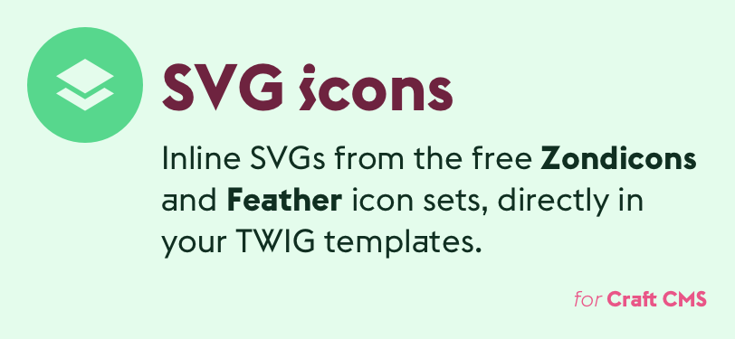

# SVG Icons plugin for Craft CMS 3.x

Craft CMS Twig extension to include SVGs from the [Feather](https://feathericons.com/) and [Zondicons](https://www.zondicons.com/) SVG icon libraries directly in your templates.

## Requirements

This plugin requires Craft CMS 3.0.0 or later.

## Installation

To install the plugin, follow these instructions.

1. Open your terminal and go to your Craft project:

        cd /path/to/project

2. Then tell Composer to load the plugin:

        composer require monachilada/craft-svgicons

3. In the Control Panel, go to Settings → Plugins and click the “Install” button for SVG Icons.

## Using SVG Icons

Filter style: `'icon-name'|feather` (or `|zondicons`) as well as function style: `svgIcon('zondicons', 'icon-name')` will work.

For example `'cpu'|feather` would result in the following:

While `svgIcon('zondicons', 'announcement')` would result in:

See [Feather](https://feathericons.com/) and [Zondicons](https://www.zondicons.com/) to browse icons and for documentation on the keys to reference them.

## SVG Icons Roadmap

Some things to do, and ideas for potential features:

* Add more icon sets as requested

Brought to you by [Mike Pierce](https://michaelpierce.trade/)
